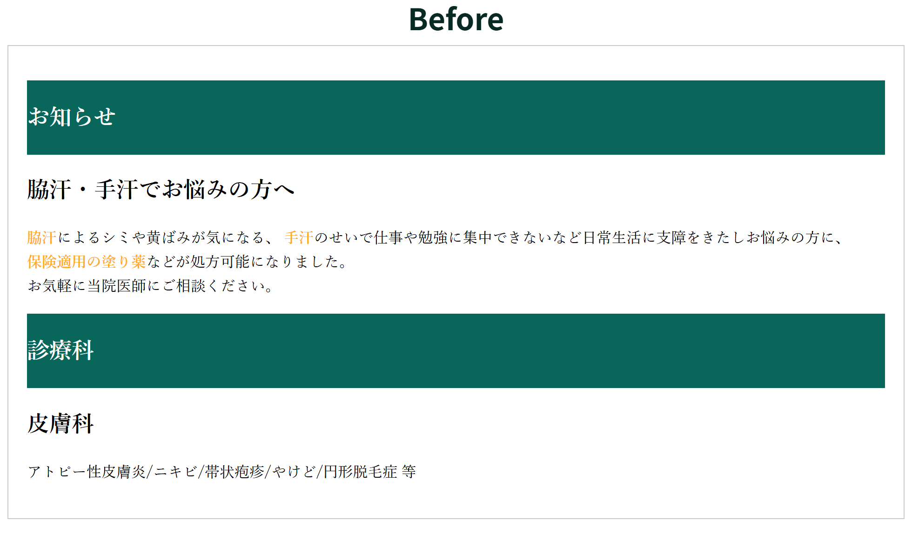
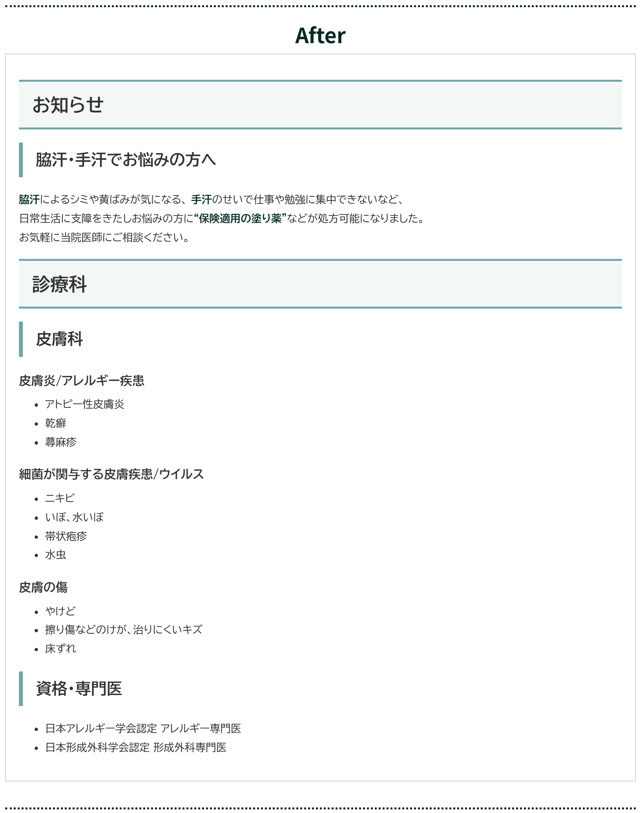
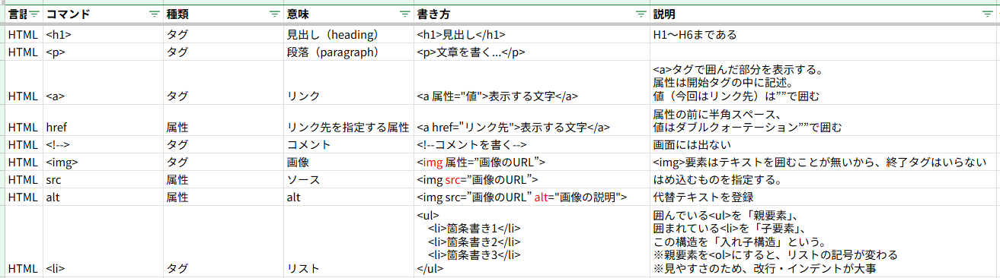

# 病院Webサイト改善提案（ポートフォリオ）

## はじめに
本リポジトリは、病院Webサイトの一部を想定し、 
“Before/After 比較”を通して「見やすさ・分かりやすさ」を改善する提案ページです。

HTML/CSSの学習成果として、 
**アクセシビリティやユーザー視点**を意識したページ構成・デザインを目指しました。

## コンセプト・制作背景
病院Webサイトを利用する中で、以下の課題を感じることありました。

- 配色のコントラストが強く、文字が読みづらい  
- 専門医の情報が探しにくい  

本制作では、**いち患者として感じた不便さ**を出発点に、  
アクセシビリティの観点から誰でも読みやすく、必要な情報を得やすい構成を意識しています。

---

## デザイン・画面構成
Before / After を上下に配置し、改善点が一目で分かる構成にしています。

### 画面イメージ( Before / After ）
※一部抜粋

## 改善前（Before）の課題
- 見出し背景や本文中の強調色が強く、**コントラスト差が小さいため読みづらい**  
- 文章量が多く、どこを読めばよいか判断しづらい  
- 診療科や専門医情報が簡潔にまとまっておらず、探しにくい

## 改善後（After）で工夫した点
- 配色を落ち着いたトーンに変更し、強調は**色ではなく太字を中心**に使用  
- BIZ UDPGothicなどの**視認性に配慮したフォント**を使用し、 行間を広げることで可読性を向上  
- 診療科・対応疾患・専門医情報を整理し、情報構造を分かりやすく作成  

## 実装で意識したこと
- HTMLは見出し階層（h1〜h3）やタグの役割が分かりやすくなるよう意識して作成  
- CSSは可読性を最優先に、現時点で理解できているプロパティのみに限定  
- Afterの見出しデザインは、WordPressを参考に作成  

### ページリンク
https://sn-0122-flower.github.io/portfolio-Hospital_website/

---

## 学習状況・制作方法
- 本ページは HTML / CSS のみで作成
- Progateを使用して HTML / CSS / JavaScript を学習  
- 学んだコマンドやプロパティはスプレッドシートにまとめ、復習しながら制作  
- AIやインターネットも参考にしつつ、**自分が理解できた内容のみ**を使用

## 今後の目標
「フロントエンド・バックエンドのコードを書けるUX/UIデザイナー」を目指し、 
コードの学習を続けながら、下記の資格取得を目標にしています。

- Java Silver 取得  
- 人間中心設計専門家（HCD専門家）  
- 色彩検定  

---

## おわりに
最後までお読みいただき、ありがとうございます。 
今後も学習と制作を重ね、 
より良いユーザー体験を考えられるエンジニア／デザイナーを目指して参ります。

